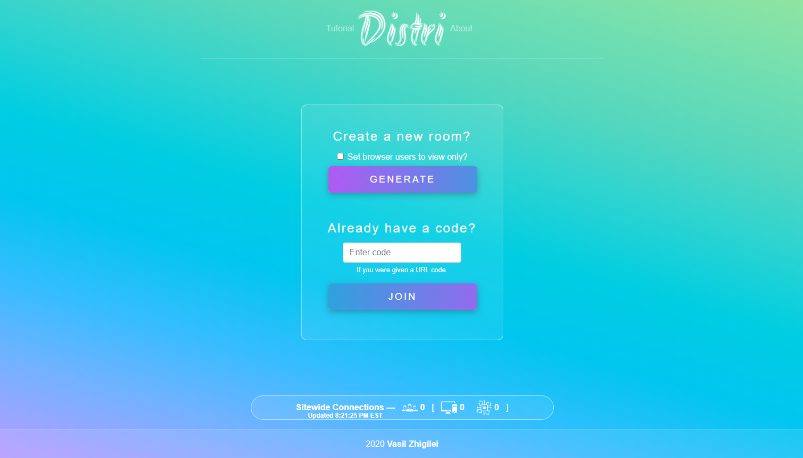
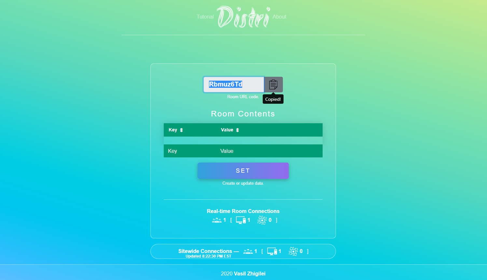
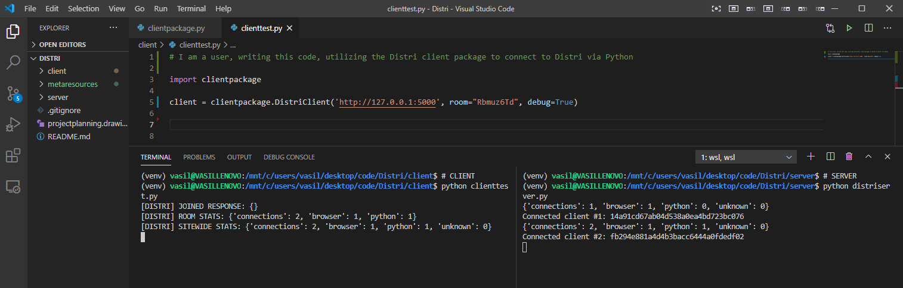
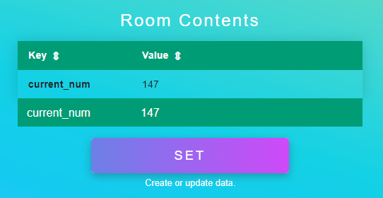
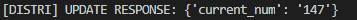
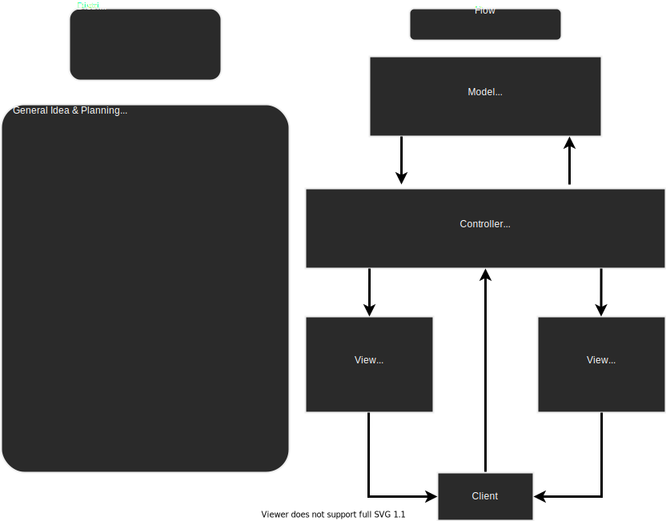

# Distri
### Quick &amp; lightweight distributed computing service

Distri is essentially a dictionary (or map) which is accessible via persistent client <-> server connections. This dictionary is, in other words, "more global than global".

More details about "What is the purpose of Distri?", technical aspects, and more are at the bottom of the README.md

## Python Client Package
### Initialization
```Python
# import Distri Python client package
import clientpackage

# Initialize client. Empty room variable generates new room on server
client = clientpackage.DistriClient(url='http://127.0.0.1:5000', room="ROOM CODE HERE", debug=True)
```
### Usage
```Python
# Read-only access to Distri dictionary
client.data()

# Room code
client.get_room()

# Room real-time statistics
client.get_room_stats()

# Distri real-time* sitewide statistics (*5s intervals)
client.get_sitewide_stats()

# Set key-value pair in Distri dictionary, overwrites current pair if exists
client.set(key="MY KEY", value="MY VALUE")
```
All data is real-time, client.get_* functions access local copies, which are automatically force-updated by server emits.

## Browser Access (and what all this looks like in action)
<span align="center">
  

<i>[Front home page browser view.]</i>
<br>
<br>

<i>[After generating a room, copying the link.]</i>
<br>
<br>

<i>[Pasting room code into our clienttest.py (which imports & utilizes the Distri clientpackage.py) and running clienttest.py.]</i>
<br>
<i>[We can see the client (LEFT TERMINAL) receive the empty dictionary, room stats, and sitewide stats. Server (RIGHT TERMINAL) shows our new client, visible as the new python client (change from 0 to 1 python connections on Distri).]</i>
<br>
<br>

<i>[Set a key-value pair through browser client as test.]</i>
<br>
<br>

<i>[clienttest.py receives new data, updating local dict. With DistriClient init param debug set to True, prints the update response in terminal.]</i>
<br>
<br>
</span>

## What is the use of Distri?
Imagine you quickly wrote a script to do something. Let's say you wish to bruteforce an HTML form 10000 times guessing a number 0-9999. You can send your script to your friend, and tell them "I'll do 0-4999, you do 5000-9999". But what if a third friend joins? What if you don't know these people and can't easily communicate quickly? 

You need a quick and easy way to implement programmatic access and control of shared data. A shared dictionary able to be read and written to by the script, from any device.
Using our previous example, what if you kept track of completed numbers guessed, and every new connected device reserves work and updates the counter by, say, +=500?
There are limitless use cases for a system like this, especially for quick scripts doing a repetitive action, process, or calculation.

## Technical side
Backend powered by Flask, uses Flask-SocketIO for server end of websockets. Websockets provide consistent client <-> server connections for both browser and Python clients. Browser frontend built with HTML/CSS/JS & Bootstrap. Socket.io is used for websocket implementation on Python and browser, Python and JS libraries used respectively.

There are two clients for Distri. Browser (GUI) and Python (programmatic access). Browser lets you see dictionary contents in a more user friendly format, however the clients do not differ in their capabilities of interacting with Distri.

## Original Project Planning Diagram Pre-Code

